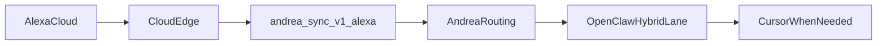

# Alexa cloud edge template

Use a thin cloud edge when you want Alexa reliability and certification readiness without exposing the local Andrea machine directly as the primary Alexa endpoint.

## Responsibilities

- Receive Alexa Custom Skill HTTPS requests on an Amazon-compatible public endpoint.
- Perform Alexa request validation at the edge.
- Forward only the raw Alexa JSON body to the local Andrea backend.
- Add a shared secret header or bearer token for the local `/v1/alexa` endpoint.
- Keep the forwarding contract small: no routing or business logic at the edge.

## Forwarding contract

- Public edge endpoint:
  - `POST /alexa`
- Local Andrea endpoint:
  - `POST /v1/alexa`
- Auth from edge to Andrea:
  - `Authorization: Bearer ${ANDREA_SYNC_ALEXA_EDGE_TOKEN}`
  - or `X-Andrea-Alexa-Edge-Token: ${ANDREA_SYNC_ALEXA_EDGE_TOKEN}`

## Reference flow



## Minimal forwarding sketch

```python
import json
import os
import urllib.request

ANDREA_SYNC_URL = os.environ["ANDREA_SYNC_URL"].rstrip("/")
EDGE_TOKEN = os.environ["ANDREA_SYNC_ALEXA_EDGE_TOKEN"]


def handler(event, context):
    body = event["body"]
    if isinstance(body, dict):
        body = json.dumps(body)
    req = urllib.request.Request(
        f"{ANDREA_SYNC_URL}/v1/alexa",
        data=body.encode("utf-8"),
        method="POST",
        headers={
            "Content-Type": "application/json",
            "Authorization": f"Bearer {EDGE_TOKEN}",
        },
    )
    with urllib.request.urlopen(req, timeout=20) as resp:
        return {
            "statusCode": resp.status,
            "headers": {"Content-Type": "application/json;charset=utf-8"},
            "body": resp.read().decode("utf-8"),
        }
```

## Notes

- Keep the edge stateless.
- Keep long-running work in Andrea/OpenClaw/Cursor; Alexa should get a short reply and Telegram should receive the richer summary.
- If you later add account linking, let the edge map Amazon identity to your own user/session data before forwarding.
